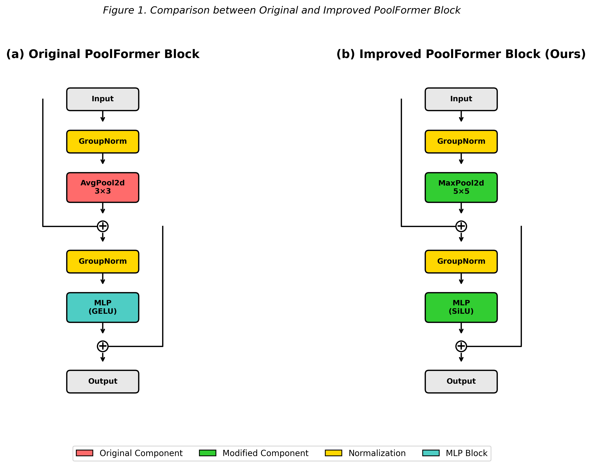
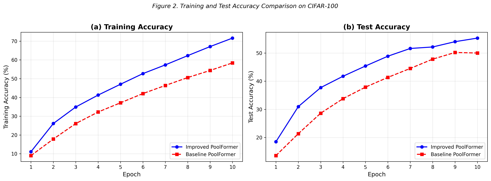
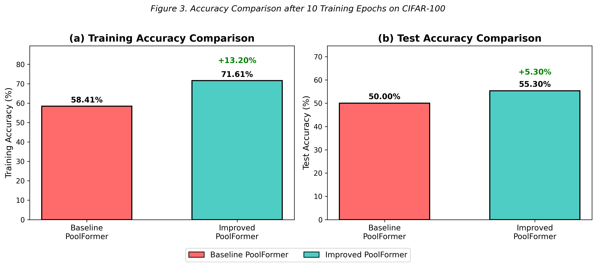
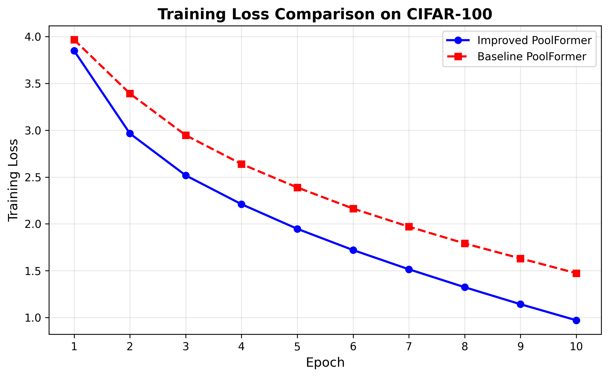

# Improving PoolFormer via Lightweight Pooling and Activation Modifications

<p align="center">
    
    
    
    
</p>

This repository contains the official implementation of the final project **"Improving PoolFormer via Lightweight Pooling and Activation Modifications"**. 

We explore lightweight architectural refinements to the original [PoolFormer](https://arxiv.org/abs/2111.11418) (CVPR 2022) to enhance its performance on fine-grained classification tasks (CIFAR-100) while preserving its simplicity and efficiency.

---

## 🚀 Project Overview

Recent studies suggest that the effectiveness of Transformer-based vision models arises more from their overall architectural design (**MetaFormer**) than from specific token mixing mechanisms. 

**PoolFormer**, a simple instantiation of MetaFormer, uses basic Average Pooling. While efficient, we hypothesize that Average Pooling tends to smooth out discriminative features, which restricts performance on fine-grained datasets like CIFAR-100.

### 💡 Proposed Optimizations
We propose two principled, parameter-free modifications to the architecture:

1.  **Token Mixer: Max Pooling (vs. Avg Pooling)**
    * **Mechanism:** Replaces uniform averaging with feature selection.
    * **Benefit:** Preserves dominant local features (edges, textures) crucial for distinguishing fine-grained classes.

2.  **Activation: SiLU / Swish (vs. GELU)**
    * **Mechanism:** Uses $x \cdot \sigma(x)$ which allows for smoother gradient propagation.
    * **Benefit:** Improves optimization stability and convergence speed.

---

## 📊 Experimental Results

We conducted controlled experiments on CIFAR-100 under a limited training budget (10 epochs) to analyze early-stage learning dynamics. The results show consistent improvements in accuracy and convergence speed.

### 1. Architecture Modification
The diagram below illustrates the structural difference between the original and our improved block.

<p align="center">
  
  <br>
  <em><strong>Figure 1:</strong> Comparison between Original PoolFormer Block (Left) and Improved Block (Right). We replace AvgPool with MaxPool and GELU with SiLU.</em>
</p>

### 2. Training Dynamics (Accuracy)
Our improved model (Blue) demonstrates significantly faster learning capability compared to the baseline (Red).

<p align="center">
  
  <br>
  <em><strong>Figure 2:</strong> Training and Test accuracy comparison over 10 epochs. The improved model consistently leads in both metrics.</em>
</p>

### 3. Final Performance Comparison
After the 10-epoch training budget, the improved model achieves a clear performance gap.

<p align="center">
  
  <br>
  <em><strong>Figure 3:</strong> Accuracy Comparison after 10 Training Epochs on CIFAR-100. We achieved a <strong>+5.30%</strong> gain in Test Accuracy.</em>
</p>

### 4. Convergence Analysis (Loss)
The loss curve indicates that our modifications facilitate better gradient flow and faster optimization.

<p align="center">
  
  <br>
  <em><strong>Figure 4:</strong> Training Loss Comparison. The improved model converges faster and achieves lower loss values.</em>
</p>

---

## 📈 Quantitative Summary

| Metric | Baseline (AvgPool + GELU) | Improved (MaxPool + SiLU) | Improvement |
| :--- | :---: | :---: | :---: |
| **Training Accuracy** | 58.41% | **71.61%** | <span style="color:green">**+13.20%**</span> |
| **Test Accuracy** | 50.00% | **55.30%** | <span style="color:green">**+5.30%**</span> |

> *Note: Results based on 10-epoch rapid prototyping experiments.*

---

## 🛠️ Installation & Usage

### Requirements
* Python 3.8+
* PyTorch >= 1.7.0
* `timm` library
* `torchvision`

```bash
# Clone the repository
git clone https://github.com/ghufronbagaskara/deeplearn-poolformer.git
cd deeplearn-poolformer

# Install dependencies
pip install torch torchvision timm
```

### Running Experiments

We provide an enhanced `run_experiment.py` script with built-in checkpointing and metrics logging.

```bash
# 1. Train from scratch (Reset previous progress)
python run_experiment.py --reset --epochs 10 --batch-size 32

# 2. Resume training (if interrupted)
python run_experiment.py --resume

# 3. Customize Hyperparameters (e.g., for RTX 4060)
python run_experiment.py --epochs 20 --lr 1e-4
```

-----

## 📜 Context & Citation

This project is built upon the research presented in **"MetaFormer Is Actually What You Need for Vision"** (CVPR 2022).

**Original Paper:** [arXiv:2111.11418](https://arxiv.org/abs/2111.11418)  
**Original Repository:** [sail-sg/poolformer](https://github.com/sail-sg/poolformer)

If you use the original PoolFormer architecture, please cite:

```bibtex
@inproceedings{yu2022metaformer,
  title={Metaformer is actually what you need for vision},
  author={Yu, Weihao and Luo, Mi and Zhou, Pan and Si, Chenyang and Zhou, Yichen and Wang, Xinchao and Feng, Jiashi and Yan, Shuicheng},
  booktitle={Proceedings of the IEEE/CVF Conference on Computer Vision and Pattern Recognition},
  pages={10819--10829},
  year={2022}
}
```

-----

### 👥 Authors (Group 5)

  * Nugraha Billy Viandy
  * Ghufron Bagaskara
  * Muhammad Danish Alfattah Lubis
  * Yusrizal Harits Firdauss

*Informatics Engineering, Universitas Brawijaya*
